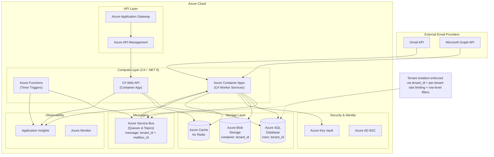
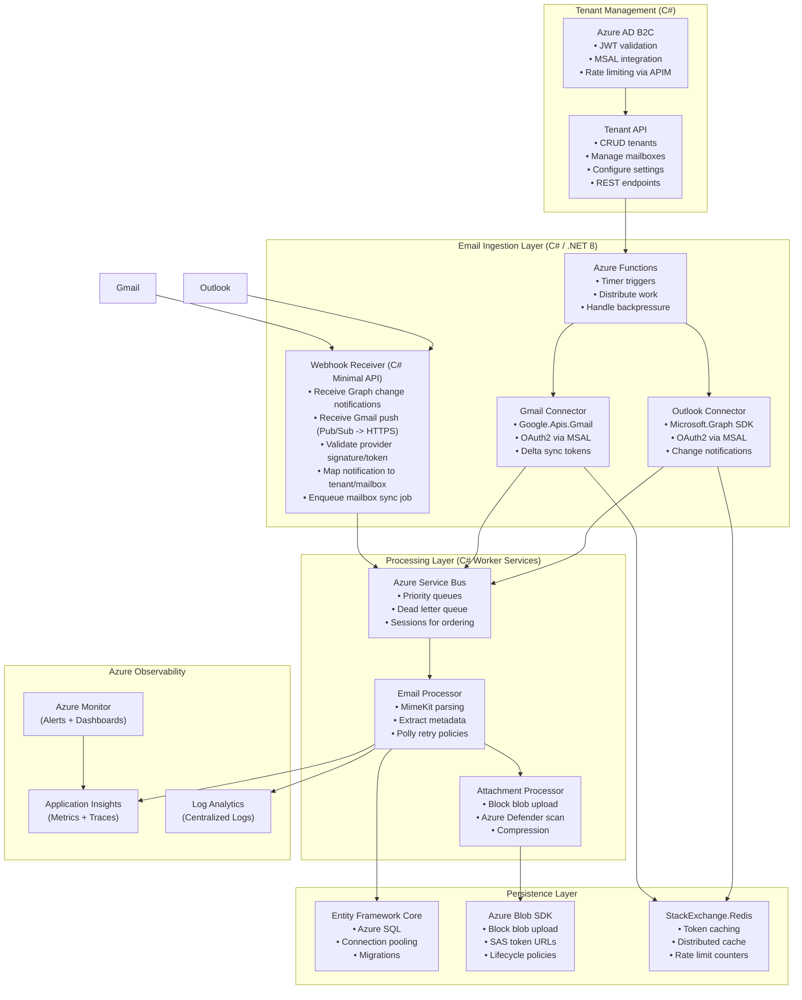
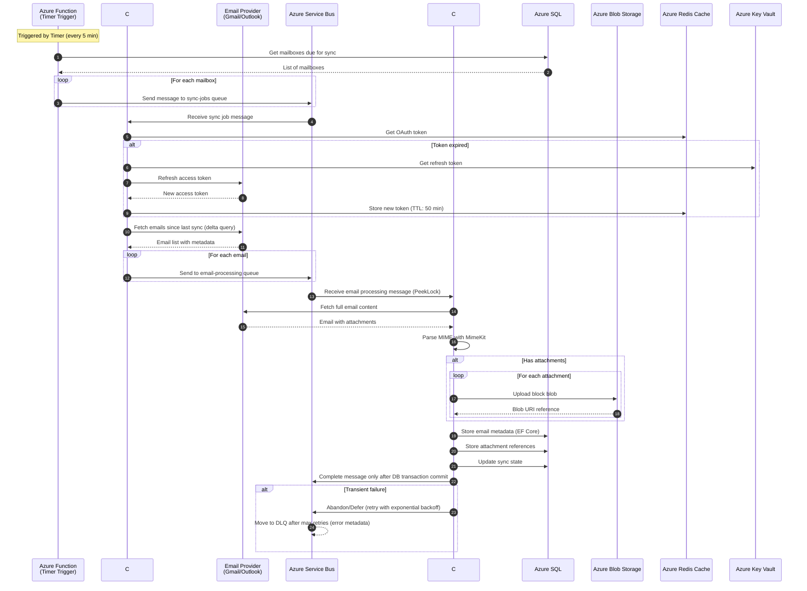
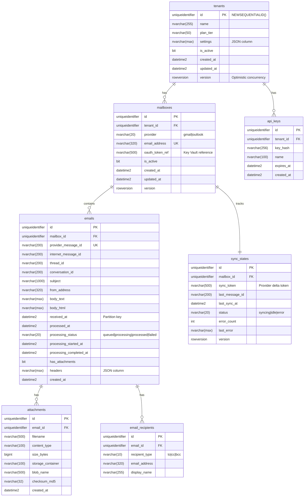
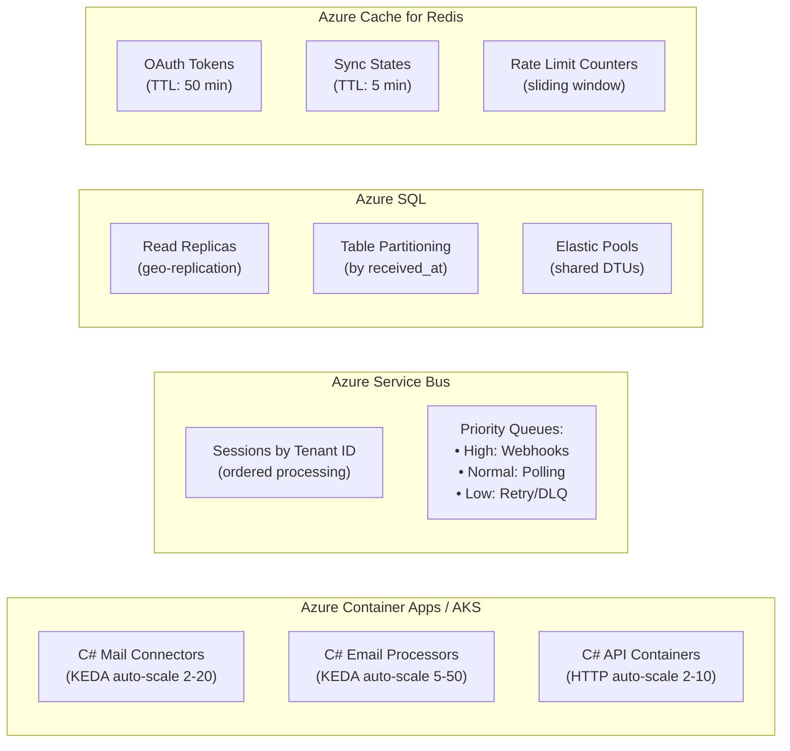
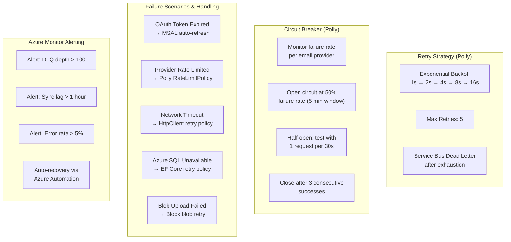
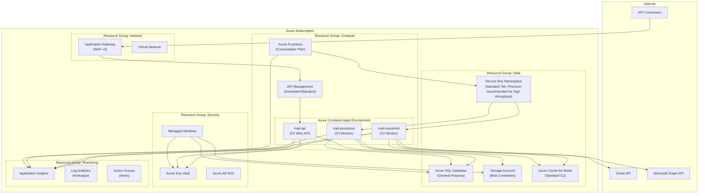

# Mail Uploader Service - Architecture Design

## Overview

This document presents the architecture design for a Mail Uploader Service that connects to multiple email providers (Gmail/Outlook), processes incoming emails and attachments, and stores them in a SQL database with multi-tenant support.
Provider-specific ingestion reduces load: Outlook uses Microsoft Graph change notifications plus delta queries, while Gmail uses push notifications (Pub/Sub) where possible or polling with historyId/delta tokens when push is unavailable.

### Requirements

- Connect to Outlook/Gmail mailboxes (multiple accounts)
- Read incoming emails and attachments
- Store email metadata and content in SQL database
- Handle medium to high load (thousands of emails per hour)
- Support multiple tenants (each tenant has their own mailboxes)

---

## 1. High-Level Architecture Diagram



Tenant isolation: tenant_id on every row + per-tenant rate limiting + queue sessions by tenant_id.

### Architecture Components

| Component | Technology | Purpose |
|-----------|------------|---------|
| **Load Balancer** | Azure Application Gateway | Distribute incoming API requests |
| **API Gateway** | Azure API Management | Authentication, rate limiting, routing |
| **Scheduler Service** | .NET 8 + Azure Functions (Timer Trigger) | Orchestrate email sync jobs |
| **Mail Connector** | .NET 8 Worker Service | Connect to email providers via OAuth2 |
| **Email Processor** | .NET 8 Worker Service | Parse and process email content |
| **Message Broker** | Azure Service Bus | Decouple ingestion from processing |
| **Database** | Azure SQL Database | Store email metadata and relationships |
| **Object Storage** | Azure Blob Storage | Store email attachments |
| **Cache** | Azure Cache for Redis | Cache tokens, sync states, rate limits |
| **Secrets Manager** | Azure Key Vault | Securely store OAuth credentials |

---

## 2. Component Diagram



### Service Responsibilities

#### Tenant Management Layer
- **Tenant API** (C# REST API): Manages tenant lifecycle, mailbox registration, and configuration
- **Auth Service** (Azure AD B2C + MSAL): Handles API authentication, JWT validation, and rate limiting per tenant

#### Email Ingestion Layer
- **Scheduler Service** (C# Azure Functions): Triggers sync jobs based on configured intervals
- **Gmail Connector** (C# Worker + Google.Apis.Gmail): Implements Gmail API with OAuth2 and delta sync
- **Outlook Connector** (C# Worker + Microsoft.Graph): Implements Graph API with OAuth2 and change notifications

#### Processing Layer
- **Email Queue** (Azure Service Bus Queues): Manages job distribution with sessions and retry policies
- **Email Processor** (C# Worker + MimeKit): Parses MIME content, extracts headers, body, and metadata
- **Attachment Processor** (C# Worker): Handles large file streaming with Azure Blob SDK

#### Persistence Layer
- **Database Service** (C# + Entity Framework Core): Manages Azure SQL connections with pooling and transactions
- **Storage Service** (C# + Azure.Storage.Blobs): Handles blob storage operations with block uploads
- **Cache Service** (C# + StackExchange.Redis): Provides fast access to frequently used data (tokens, sync state)

---

## 3. Data Flow Diagram



### Data Flow Steps

1. **Trigger**: Scheduler runs on cron (e.g., every 5 minutes) or receives webhook notification
2. **Job Distribution**: Mailboxes needing sync are queued as individual jobs
3. **Authentication**: Connector retrieves/refreshes OAuth tokens from cache
4. **Delta Sync**: Connector fetches only new emails using provider's sync tokens
5. **Processing Queue**: Each email is enqueued for parallel processing
6. **Content Parsing**: Processor fetches full email and parses MIME structure
7. **Attachment Upload**: Large attachments are streamed directly to object storage
8. **Persistence**: Email metadata and attachment references are stored in database
9. **State Update**: Sync token is updated to enable efficient delta sync next time

---

## 3.1 Idempotency & Deduplication
- **Email unique key**: `(mailbox_id, provider_message_id)` with a unique constraint; mailbox_id implies tenant.
- **Attachment dedup**: content hash (e.g., MD5/SHA256) + size to avoid duplicate storage.
- **Retry safety**: processing is idempotent; the broker provides at-least-once delivery and duplicates are filtered by the unique key and attachment hash.

## 4. Database Schema Design



### Table Descriptions

| Table | Description |
|-------|-------------|
| **tenants** | Organizations using the service, with plan tier and settings |
| **api_keys** | API authentication keys per tenant for secure access |
| **mailboxes** | Email accounts registered for syncing, linked to tenants |
| **sync_states** | Tracks sync progress per mailbox with delta tokens |
| **emails** | Email metadata including subject, body, headers, provider/internet IDs, thread/conversation IDs, and processing status |
| **email_recipients** | Normalized recipients (to, cc, bcc) per email |
| **attachments** | Attachment metadata with references to object storage |

Relationships and constraints: tenants → mailboxes → emails → attachments/recipients, with foreign keys and a unique constraint on `(mailbox_id, provider_message_id)` to prevent duplicates.

### Index Strategy (Azure SQL)

```sql
-- Performance indexes for common queries
CREATE NONCLUSTERED INDEX IX_mailboxes_tenant_active 
    ON mailboxes(tenant_id, is_active) INCLUDE (email_address, provider);

CREATE NONCLUSTERED INDEX IX_emails_mailbox_received 
    ON emails(mailbox_id, received_at DESC) INCLUDE (subject, from_address);

CREATE UNIQUE NONCLUSTERED INDEX IX_emails_provider_message 
    ON emails(mailbox_id, provider_message_id);

CREATE NONCLUSTERED INDEX IX_emails_internet_message
    ON emails(mailbox_id, internet_message_id);

CREATE NONCLUSTERED INDEX IX_emails_thread_conversation
    ON emails(mailbox_id, thread_id, conversation_id);

CREATE NONCLUSTERED INDEX IX_emails_processing_status
    ON emails(mailbox_id, processing_status, processing_started_at);

CREATE NONCLUSTERED INDEX IX_sync_states_status 
    ON sync_states(status, last_sync_at);

CREATE NONCLUSTERED INDEX IX_attachments_email 
    ON attachments(email_id) INCLUDE (filename, content_type, size_bytes);

-- Full-text search on email content (Azure SQL Full-Text Search)
CREATE FULLTEXT CATALOG EmailsCatalog AS DEFAULT;
CREATE FULLTEXT INDEX ON emails(subject, body_text) 
    KEY INDEX PK_emails ON EmailsCatalog;
```

### Partitioning Strategy (Azure SQL)

```sql
-- Create partition function for monthly partitions
CREATE PARTITION FUNCTION PF_EmailsByMonth (DATETIME2)
AS RANGE RIGHT FOR VALUES (
    '2024-01-01', '2024-02-01', '2024-03-01', '2024-04-01',
    '2024-05-01', '2024-06-01', '2024-07-01', '2024-08-01',
    '2024-09-01', '2024-10-01', '2024-11-01', '2024-12-01'
);

-- Create partition scheme
CREATE PARTITION SCHEME PS_EmailsByMonth
AS PARTITION PF_EmailsByMonth ALL TO ([PRIMARY]);

-- Create partitioned emails table
CREATE TABLE emails (
    id UNIQUEIDENTIFIER PRIMARY KEY DEFAULT NEWSEQUENTIALID(),
    mailbox_id UNIQUEIDENTIFIER NOT NULL,
    received_at DATETIME2 NOT NULL,
    -- ... other columns
) ON PS_EmailsByMonth(received_at);
```

---

## 5. Scaling Strategy and Failure Handling

### Scaling Architecture (Azure)



### Scaling Approach (Azure)

| Component | Scaling Method | Trigger Metrics |
|-----------|---------------|-----------------|
| **Mail Connectors** (C#) | Azure Container Apps / AKS autoscaling | Service Bus queue depth > 1000 |
| **Email Processors** (C#) | KEDA (Kubernetes Event-Driven Autoscaling) | Service Bus message count > threshold |
| **API Gateway** | Azure API Management auto-scale | Request rate > 1000 RPS |
| **Database** | Azure SQL Elastic Pools + Read Replicas | DTU usage > 80% |
| **Object Storage** | Azure Blob Storage (inherently scalable) | N/A |
| **Message Queue** | Azure Service Bus (Premium recommended for high throughput) | Built-in scaling |
| **Azure Functions** | Consumption plan (automatic scaling) | Event-driven |

### Throughput Calculations

For **thousands of emails per hour**:

```
Target: 5,000 emails/hour = ~1.4 emails/second

With 10 processor workers:
- Each worker handles: 0.14 emails/second
- Processing time budget: ~7 seconds per email
- Includes: API fetch, parse, attachment upload, DB write

Buffer for burst (3x peak):
- 15,000 emails/hour = ~4.2 emails/second
- 20 workers = 0.21 emails/second each
- Processing time budget: ~4.7 seconds per email
```

### Failure Handling Strategy



### Failure Handling Details

#### 0. Backpressure and Autoscaling
- Use queue depth to throttle ingestion and scale workers (KEDA/ACA) to avoid overloading providers and the database.
- When depth exceeds thresholds, slow scheduling or pause new mailbox sync jobs.

#### 0.1 Retry Policy + DLQ Rules
- Exponential backoff with bounded retries for transient failures.
- After retry exhaustion, move messages to DLQ with error metadata for investigation and replay.

#### 1. Idempotency
- Use `(mailbox_id, provider_message_id)` as the deduplication key with a unique constraint (mailbox is tenant-scoped)
- EF Core upsert operations prevent duplicate email storage
- Attachment uploads use MD5 content hash for verification

#### 2. At-Least-Once Delivery (Azure Service Bus)
- Use `PeekLock` mode - messages acknowledged only after successful processing
- EF Core `SaveChangesAsync()` commits before `CompleteMessageAsync()`
- Service Bus duplicate detection window (10 min) as safety net

#### 3. Graceful Degradation
- If Blob Storage fails, store email metadata without attachments
- Flag email for attachment retry in `sync_states.last_error`
- Continue processing remaining emails in the batch

#### 3.1 Partial Attachment Failures
- If some attachments fail, mark email `processing_status=failed` and retry only failed attachments without re-ingesting the email.

#### 4. Multi-Tenant Isolation
- Service Bus Sessions grouped by `tenant_id` for ordered processing
- Per-tenant rate limits via Azure API Management policies
- Tenant-specific Polly circuit breakers isolate provider failures

#### 4.1 Token/Auth Failures and Mailbox Health
- On token refresh failures, mark mailbox health as `error` and pause further sync until re-authenticated.
- Expose mailbox health status for operational visibility and alerting.

#### 5. Data Consistency
- EF Core transactions with `IsolationLevel.ReadCommitted`
- Optimistic concurrency with `[Timestamp]` attribute on sync state
- Soft deletes with `DeletedAt` column for compliance requirements

#### 6. C# Resilience Patterns (Polly)
```csharp
// Example Polly policy configuration in C#
services.AddHttpClient<IGmailClient>()
    .AddPolicyHandler(Policy
        .WaitAndRetryAsync(5, retryAttempt => 
            TimeSpan.FromSeconds(Math.Pow(2, retryAttempt))))
    .AddPolicyHandler(Policy
        .CircuitBreakerAsync(5, TimeSpan.FromMinutes(1)));
```

### Monitoring & Alerting (Azure Monitor)

| Metric | Warning Threshold | Critical Threshold | Azure Service |
|--------|-------------------|-------------------|---------------|
| Queue Depth | > 5,000 messages | > 20,000 messages | Service Bus Metrics |
| Processing Latency (p99) | > 10 seconds | > 30 seconds | Application Insights |
| Error Rate | > 1% | > 5% | Application Insights |
| Sync Lag | > 30 minutes | > 2 hours | Custom Metrics |
| Dead Letter Queue Size | > 50 messages | > 200 messages | Service Bus DLQ |
| OAuth Refresh Failures | > 3 per mailbox | > 10 per tenant | Application Insights |
| DTU Usage | > 70% | > 90% | Azure SQL Metrics |
| Blob Storage Latency | > 500ms | > 2000ms | Storage Analytics |

**Azure Alerting Setup:**
- Use Azure Monitor Action Groups for notifications (Email, SMS, Teams, PagerDuty)
- Configure Log Analytics workspace for centralized logging
- Set up Application Insights dashboards for real-time monitoring
- Use Azure Workbooks for custom reporting and visualization

---

## Summary

This architecture provides:

| Aspect | Implementation |
|--------|---------------|
| **Scalability** | Azure Container Apps with KEDA, Service Bus partitioning, Azure SQL elastic pools |
| **Reliability** | Polly retry/circuit breaker, Service Bus dead letter queues, Azure SQL geo-replication |
| **Multi-tenancy** | Service Bus sessions, APIM rate limiting, Key Vault credential isolation |
| **Performance** | Async/await patterns, Azure Cache for Redis, EF Core connection pooling |
| **Observability** | Application Insights distributed tracing, Log Analytics, Azure Monitor dashboards |

The design handles **thousands of emails per hour** by:
1. Decoupling ingestion from processing through Azure Service Bus queues
2. KEDA-based autoscaling of C# Worker containers based on queue depth
3. Using delta sync tokens to minimize API calls to email providers
4. Streaming large attachments directly to Azure Blob Storage (block blobs)
5. Caching OAuth tokens and sync states in Azure Cache for Redis

---

## Why This Architecture Was Designed This Way
- **Broker-decoupled ingestion** separates mailbox polling/webhooks from processing to handle bursty provider traffic and meet throughput requirements without dropping messages.
- **Provider-specific delta sync** (Gmail historyId, Graph delta + change notifications) reduces API load and rate-limit risk compared to full mailbox polling, aligning with scalability requirements.
- **Multi-tenancy enforced at API, queue, and DB layers** ensures data isolation and predictable per-tenant behavior under load, matching the assignment’s multi-tenant requirement.
- **Blob storage for attachments** keeps large binaries out of SQL to reduce database load and improve upload reliability, supporting high-volume ingestion.
- **Idempotency and deduplication** prevent duplicate storage under at-least-once delivery and retries, preserving correctness.
- **Queue-driven autoscaling** reacts to actual backlog rather than schedules, improving throughput and cost-efficiency for variable email volume.
- **Eventual consistency** is acceptable because ingestion pipelines are asynchronous by design; it maximizes reliability and keeps the system responsive under load.

---

## Technology Stack (C# / .NET 8 + Azure)

| Layer | Technology | Purpose |
|-------|------------|---------|
| **Language** | C# 12 | Primary programming language |
| **Runtime** | .NET 8 | Modern, high-performance runtime |
| **Web API** | C# REST API (Minimal APIs) | RESTful API endpoints |
| **Background Workers** | C# Worker Service | Long-running email processing |
| **Serverless** | C# Azure Functions | Timer triggers, event processing |
| **Message Queue** | Azure Service Bus | Enterprise messaging with queues/topics |
| **Database** | Azure SQL Database | Managed SQL with auto-scaling |
| **Object Storage** | Azure Blob Storage | Attachment storage with tiers |
| **Cache** | Azure Cache for Redis | Distributed caching |
| **Secrets** | Azure Key Vault | Secure credential management |
| **Identity** | Azure AD / MSAL | OAuth2 token management |
| **Container Orchestration** | Azure Container Apps / AKS | Container management |
| **Observability** | Azure Monitor + Application Insights | Logging, metrics, tracing |
| **API Management** | Azure API Management | Gateway, throttling, policies |

### Key C# / .NET Libraries

| Library | Purpose |
|---------|---------|
| **Microsoft.Graph** | Microsoft 365 / Outlook API client |
| **Google.Apis.Gmail.v1** | Gmail API client |
| **MimeKit** | Email MIME parsing |
| **Azure.Messaging.ServiceBus** | Service Bus SDK |
| **Azure.Storage.Blobs** | Blob Storage SDK |
| **Microsoft.EntityFrameworkCore** | ORM for Azure SQL |
| **Polly** | Resilience and retry policies |
| **MediatR** | CQRS and mediator pattern |

---

## Azure Deployment Architecture

